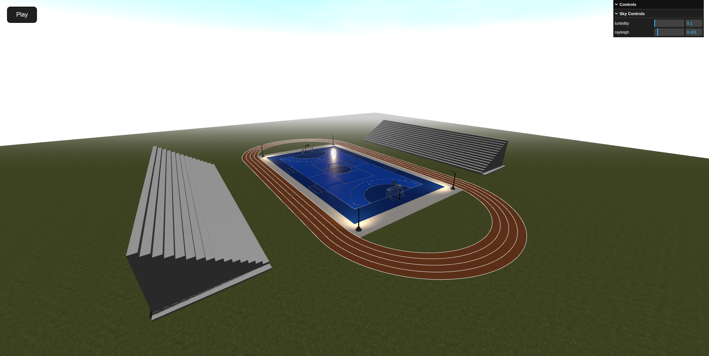
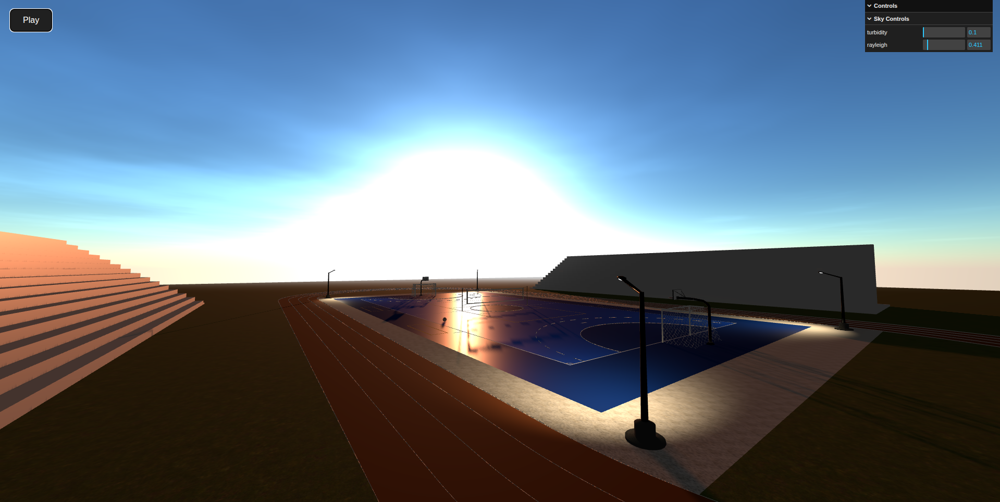
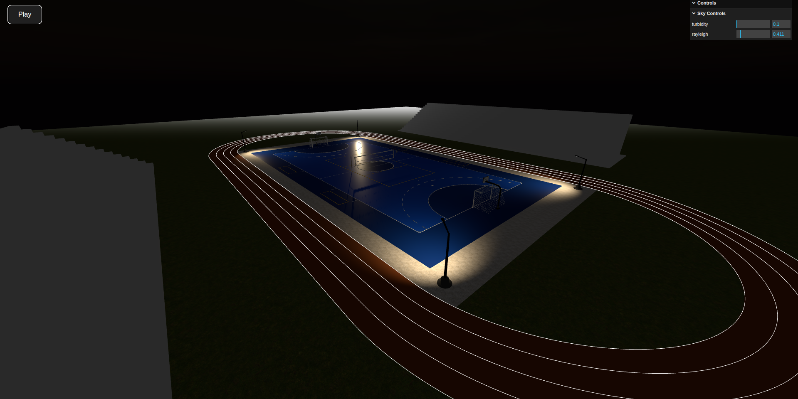

# UFCourt

A project developed using Three.js to create an interactive 3D experience for UFC court environment.

---

## 👥 Team Members

| Name                                    | Email                         |
| --------------------------------------- | ----------------------------- |
| Luis Felipe Pessoa Lacerda              | engluisfelipepessoa@gmail.com |
| Francisco Lucas Xavier Mapurunga Vieira | lucas.vieira@alu.ufc.br       |
| Pedro Rickson Fernandes Aragão          | pedrorickson95.fa@gmail.com   |
| Ruan Pereira do Nascimento              | ruanpereira@alu.ufc.br        |

---

## 📌 About the Project

UFCCourt is a 3D interactive environment developed with JavaScript and Three.js, rendered directly in the browser using WebGL.

---

## 🛠️ Technologies Used

- JavaScript
- Three.js
- Node.js
- npm
- Vite
- lil-gui
- WebGL

---

## ✨ Features

- Interactive 3D environment
- Real-time shadows
- Camera movement controls
- Dynamic lighting system
- HDR environment maps
- Physics and collision system
- lil-gui integration for real-time scene adjustments
- Turbidity and Rayleigh atmospheric controls using lil-gui

---

# Development Environment

## Requirements

- Node.js
- npm

## Installation

```bash
npm install
```

## Run Development Server

```bash
npm run dev
```

## Build Project

```bash
npm run build
```

---

## 📂 Project Structure

```bash
UFCCourt/
├── public/
│   ├── hdr/
│   ├── models/
│   └── textures/
│
├── src/
│   ├── assets/
│   ├── camera/
│   ├── controls/
│   ├── gui/
│   ├── lights/
│   ├── loaders/
│   ├── objects/
│   ├── physics/
│   ├── renderer/
│   ├── scene/
│   ├── utils/
│   ├── main.js
│   └── style.css
│
├── LICENSE
├── README.md
├── index.html
├── package-lock.json
└── package.json
```

---

### `public/`

Contains static files served directly by the application.

#### `public/hdr/`

Stores HDR environment maps used for realistic scene lighting and reflections.

#### `public/models/`

Contains all 3D models used in the project.

#### `public/textures/`

Stores textures and material maps applied to 3D objects.

---

### `src/`

Main source code directory of the application.

#### `src/assets/`

Contains general assets and reusable resources used throughout the project.

#### `src/camera/`

Responsible for camera creation, positioning, and configuration.

#### `src/controls/`

Handles user interaction and camera movement controls.

#### `src/gui/`

Contains GUI configuration and debugging interface controls.

#### `src/lights/`

Manages scene lighting setup and light configurations.

#### `src/loaders/`

Responsible for loading models, textures, HDR files, and other external assets.

#### `src/objects/`

Contains the creation and configuration of 3D scene objects.

#### `src/physics/`

Handles physics calculations, collisions, and related logic.

#### `src/renderer/`

Responsible for renderer creation and rendering configuration.

#### `src/scene/`

Manages scene initialization and scene-related setup.

#### `src/utils/`

Contains utility functions and reusable helper methods.

#### `src/main.js`

Main entry point of the application where all systems are initialized.

#### `src/style.css`

Global styles used throughout the application.

---

### `index.html`

Main HTML file used to render the application.

### `package.json`

Contains project metadata, dependencies, and npm scripts.

### `package-lock.json`

Automatically generated file that locks dependency versions.

### `README.md`

Project documentation and setup instructions.

### `LICENSE`

Project license information.

---

## 🎮 Controls

After entering the experience and clicking the **Play** button, you can use the following controls:

| Key   | Action        |
| ----- | ------------- |
| W     | Move forward  |
| A     | Move left     |
| S     | Move backward |
| D     | Move right    |
| Space | Move up       |
| Shift | Move down     |
| Mouse | Look around   |

---

### 🌤️ Environment Controls

The project also includes a lil-gui panel that allows real-time atmospheric adjustments:

| Control   | Description                                     |
| --------- | ----------------------------------------------- |
| Turbidity | Controls the haze and density of the atmosphere |
| Rayleigh  | Controls atmospheric light scattering intensity |

---

## 📷 Project Preview

### ☀️ Day Environment



### 🌅 Sunset Environment



### 🌙 Night Environment



```

```
